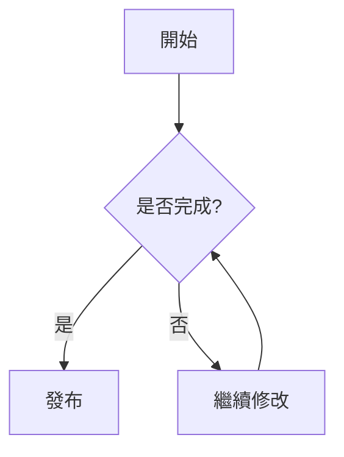

# Fuwari 博客特殊 Markdown 語法指南 (Cheat Sheet)

本指南列出了目前這個 Fuwari 博客程序支持的所有**特殊 Markdown 標記**與**自定義組件**之使用方式。有了這些語法，你可以讓文章內容更加豐富、互動性更強。

---

## 1. Spoiler (隱藏文字 / 防劇透) 🆕
這是在底層使用 Rehype 解析的自定義防劇透遮罩功能。被隱藏的文字預設會顯示為與背景顏色相同的色塊，當使用者將滑鼠懸停 (Hover) 於色塊上方時，隱藏的內容才會以主體顏色 (Primary Color) 顯現出來。

**語法：**
```markdown
這是一段正常文字，||這是一段被隱藏的防劇透內容||，然後段落繼續。
```

**效果：**
這是一段正常文字，<span style="background-color: #333; color: #333; border-radius: 4px; padding: 0 4px;">這是一段被隱藏的防劇透內容</span>，然後段落繼續。

---

## 2. Admonitions (多風格提示框)
這套主題支援將 GitHub 格式的 `> [!NOTE]` 或原生的 `:::` 轉換為漂亮的多彩提示區塊。強烈建議直接使用原生的 `:::` 宣告來取得最佳相容性。

**語法：**
```markdown
:::tip
這是一個實用的技巧提示 (綠色)。
:::

:::note
這是一段普通的筆記或備註 (預設藍色)。
:::

:::important
這是一段重要的訊息 (紫色)。
:::

:::warning
這是一個需要注意的警告 (橘色)。
:::

:::caution
這是一個嚴重的危險提示 (紅色與驚嘆號圖示)。
:::
```

---

## 3. 連結預覽卡片 (URL Card) 🆕
為外部連結自動抓取網站 Favicon、Title 與 Description，並產生一個美觀的預覽卡片。此功能在渲染時會透過 JavaScript 動態抓取資料並呈現載入動畫。

**語法：**
```markdown
::url{href="https://google.com"}
```

---

## 4. GitHub 倉庫卡片 (Repo Card)
這是一個專屬的 GitHub 預覽組件，能自動顯示 Repo 的 Star 數、Fork 數、授權條款與簡介。

**語法：**
```markdown
::github{repo="saicaca/fuwari"}
```

---

## 5. 數學公式 (KaTeX)
透過 `remarkMath` 與 `rehypeKatex` 支持標準的 LaTeX 數學公式渲染。

**行內公式語法：**
```markdown
這是一個著名的公式 $E = mc^2$。
```

**區塊公式語法：**
```markdown
$$
x = \frac{-b \pm \sqrt{b^2 - 4ac}}{2a}
$$
```

---

## 6. 強化的代碼區塊 (Expressive Code)
這套主題透過整合 `Astro Expressive Code` 提供了非常強大的代碼區塊功能，你不僅能為代碼標上檔案名稱，還能針對特定行高亮。

**自訂檔名 (Title)：**
````markdown
```javascript title="app.js"
console.log("Hello Fuwari!");
```
````

---

## 7. Mermaid 圖表

文章可以使用 Mermaid 語法繪製流程圖、時序圖、狀態圖等。寫作時使用 `mermaid` 代碼區塊即可，建構後會在前台自動渲染成 SVG 圖表。

**語法：**

````markdown

````

**適合用途：**

- 技術流程說明
- 系統架構草圖
- 時序圖
- 決策流程

---

## 8. 外鏈自動處理

Markdown 裡的外部連結會在建構時自動加上安全屬性：

```html
target="_blank"
rel="noopener noreferrer"
```

這代表外部網站會在新分頁打開，並且不會拿到目前頁面的 `window.opener` 權限。站內相對連結、錨點、`mailto:`、`tel:` 不會被處理。

**語法不需要改變：**

```markdown
[OpenAI](https://openai.com)
[站內文章](/posts/example/)
```

第一個會被當成外鏈處理，第二個仍然是普通站內連結。

---

## 9. 本地 pnpm 内容维护脚本

这些命令不是 Markdown 渲染语法，而是写作和维护文章时可以在终端运行的辅助工具。

### `pnpm new-post -- <filename>`

创建一篇新的 Markdown 文章。

实际行为：

- 如果没有传入文件名，会报错退出。
- 如果文件名没有 `.md` 或 `.mdx` 后缀，会自动补成 `.md`。
- 文件会创建到 `src/content/posts/` 下。
- 支持多级路径，例如 `pnpm new-post -- travel/hong-kong-note` 会自动创建目录。
- 如果目标文件已经存在，会报错退出，避免覆盖旧文章。
- 新文件会自动写入基础 frontmatter。

生成的 frontmatter 包含：

```yaml
title: <filename>
published: <当天日期>
description: ''
image: ''
tags: []
category: ''
draft: false
lang: ''
```

适合用来快速开新文章草稿。

---

### `pnpm post-commit`

根据当前 Git 工作区里变动过的文章，自动生成提交并推送。

实际行为：

- 读取 `git status --porcelain`。
- 只处理 `src/content/posts/` 下发生变动的 `.md` / `.mdx` 文件。
- 支持 Git rename 记录，会取重命名后的新路径。
- 会跳过被删除的文章文件，避免读取不存在的文件。
- 读取文章 frontmatter 里的 `title` 和 `description`。
- 判断文章是否是 Git 里尚未跟踪的新文件。
- 对每篇变动文章执行 `git add`。
- 对每篇变动文章单独执行一次 `git commit`，并用 pathspec 限定只提交当前文章文件。
- 所有 commit 完成后执行 `git push`。
- 提交信息格式为 `posts: publish "Title": description` 或 `posts: update "Title": description`。

需要注意：

- 这个脚本会真实提交并推送，不是 dry-run。
- 如果没有变动的文章文件，会报错退出。
- 如果文章没有 `title`，会跳过那篇文章。
- 它只适合提交文章文件；如果同时有代码改动，建议先单独处理代码改动，避免工作区状态太混乱。

适合在只改文章内容时快速提交，但不适合和代码改动混在一起使用。

### `pnpm fix-images`

检查文章中连续排列的图片，并在图片之间补空行，让 Markdown 排版更稳定。

默认行为：

- 扫描 `src/content/posts/` 下所有 `.md` 和 `.mdx` 文件。
- 识别连续的 Markdown 图片行。
- 识别连续的单行 HTML `` 图片行。
- 跳过代码块中的内容，避免误改示例代码。
- 默认只报告会修改哪些文件，不会写入。

例如它会把：

```markdown


```

整理为：

```markdown


```

真正写入文件需要显式加 `--write`：

```powershell
pnpm fix-images -- --write
```

适合在文章里插入多张连续图片后统一整理排版。

**指定行號高亮 (Highlight) 與刪增 (Diff)：**
````markdown
```python {1, 3-5} ins={2} del={6}
# 1, 3, 4, 5 行會被標記高亮
# 第 2 行前會出現綠色的 + 號並高亮
# 第 6 行前會出現紅色的 - 號並顯示刪除效果
```
````

**可折疊的代碼區塊 (Collapsible Sections)：**
如果代碼太長，可以預設折疊某幾行。
````markdown
```html collapse={2-8}
<ul>
	<li>隱藏的項目 1</li>
	<li>隱藏的項目 2</li>
    <!-- ... 中間的都會被折疊，需要點擊展開 -->
</ul>
```
````
