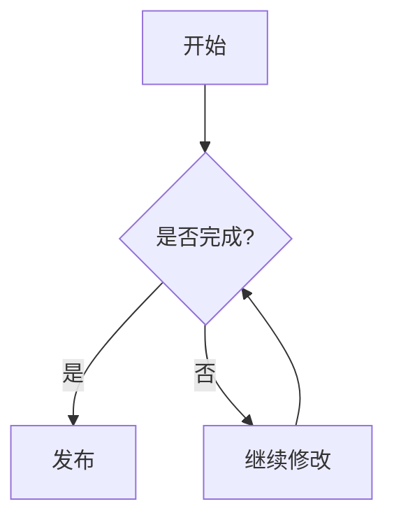

# Fuwari 写作与维护速查表

这份文档记录当前站点支持的特殊 Markdown 语法、自定义组件，以及本地常用维护脚本。它适合在写文章、排版和提交文章时快速查阅。

---

## 1. 文章 Frontmatter

文章通常放在 `src/content/posts/` 下，文件扩展名可以是 `.md` 或 `.mdx`。

常用 frontmatter 示例：

```yaml
---
title: 文章标题
published: 2026-04-18
updated: 2026-04-20
description: 简短摘要
image: ./cover.jpg
tags:
  - 旅行
category: 旅行
draft: false
lang: ''
---
```

说明：

- `title` 是文章标题，也是自动提交脚本生成提交信息时会读取的字段。
- `description` 会用于文章摘要，也会被 `pnpm post-commit` 放进提交信息。
- `published` 使用 `YYYY-MM-DD` 格式。
- `updated` 可选，用于标记文章最后修改日期；没有修改日期时可以不写。
- `image` 是文章封面图。可以写网络图片、`public` 目录下的绝对路径，或相对于当前 Markdown 文件的本地图片，例如 `./cover.jpg`。
- `draft: true` 表示草稿，`draft: false` 表示发布。
- `tags` 和 `category` 用于归档与筛选。
- `prevTitle`、`prevSlug`、`nextTitle`、`nextSlug` 是内部字段，正常写文章不要手动填写。

草稿显示规则：

- 本地开发环境会显示草稿，方便预览。
- 生产构建会隐藏 `draft: true` 的文章。

如果文章有标题图片或配图，推荐使用文章子目录，把正文写成 `index.md`，图片放在同一目录：

```text
src/content/posts/my-post/
├── index.md
└── cover.jpeg
```

然后在 `index.md` 的 frontmatter 里写：

```yaml
image: ./cover.jpeg
```

这种写法最适合文章专属封面图，移动、备份和删除文章时也更好整理。

---

## 2. Spoiler 隐藏文字

站点支持防剧透隐藏文字。被隐藏内容默认以遮罩形式显示，鼠标悬停后显示正文。

语法：

```markdown
这是一段正常文字，||这是一段被隐藏的内容||，然后段落继续。
```

草稿里还展示了文本指令写法，这种写法可以在隐藏内容里继续使用 Markdown：

```markdown
The content :spoiler[is hidden **ayyy**]!
```

适合用途：

- 剧透内容
- 答案折叠
- 不希望第一眼看到的补充信息

---

## 3. Admonitions 提示框

推荐使用 `:::` 语法写提示框。

```markdown
:::tip
这是一个技巧提示。
:::

:::note
这是普通笔记。
:::

:::important
这是重要信息。
:::

:::warning
这是警告内容。
:::

:::caution
这是严重风险提示。
:::
```

提示框可以自定义标题：

```markdown
:::note[自定义标题]
这是带自定义标题的笔记。
:::
```

支持的类型：

- `tip`
- `note`
- `important`
- `warning`
- `caution`

也支持 GitHub 风格的 admonition：

```markdown
> [!NOTE]
> 这是一段 GitHub 风格提示。
```

---

## 4. URL 预览卡片

外部链接可以写成 URL 卡片。页面渲染时会尝试抓取网站图标、标题和描述。

```markdown
::url{href="https://google.com"}
```

注意：

- 这个组件适合展示外部网页。
- 数据由前端动态获取，网络不可用时可能只显示加载或错误状态。

---

## 5. GitHub 仓库卡片

可以用 GitHub 卡片展示仓库信息。

```markdown
::github{repo="saicaca/fuwari"}
```

说明：

- `repo` 格式是 `owner/repo`。
- 组件会请求 GitHub API 显示仓库名称、简介、星标、分叉和许可证等信息。

---

## 6. 数学公式 KaTeX

站点通过 `remark-math` 和 `rehype-katex` 支持 LaTeX 数学公式。

行内公式：

```markdown
这是一个著名公式 $E = mc^2$。
```

块级公式：

```markdown
$$
x = \frac{-b \pm \sqrt{b^2 - 4ac}}{2a}
$$
```

---

## 7. Expressive Code 代码块

代码块支持文件名、行高亮、增删标记和折叠区间。

带文件名：

````markdown
```javascript title="app.js"
console.log("Hello Fuwari!");
```
````

指定行高亮与增删：

````markdown
```python {1,3-5} ins={2} del={6}
# 第 1、3、4、5 行会高亮
# 第 2 行会显示新增效果
# 第 6 行会显示删除效果
```
````

折叠部分代码：

````markdown
```html collapse={2-8}
<ul>
  <li>隐藏的项目 1</li>
  <li>隐藏的项目 2</li>
  <!-- 中间内容默认折叠 -->
</ul>
```
````

草稿里的 `expressive-code.md` 还展示了这些常用参数：

````markdown
```bash title="PowerShell terminal example"
echo "带标题的终端代码块"
```

```sh frame="none"
echo "不显示代码框架"
```

```diff lang="js"
- console.log("old")
+ console.log("new")
```

```js wrap=false
const longText = "这段很长的内容不会自动换行"
```

```js showLineNumbers startLineNumber=5
console.log("从第 5 行开始显示行号")
```

```ansi
ANSI 颜色输出也可以渲染
```
````

---

## 8. Mermaid 图表

文章可以通过 `mermaid` 代码块绘制流程图、时序图、状态图等。

````markdown

```mermaid
flowchart TD
  A[开始] --> B{是否完成?}
  B -- 是 --> C[发布]
  B -- 否 --> D[继续修改]
  D --> B
```
````

适合用途：

- 技术流程说明
- 系统架构草图
- 时序图
- 决策流程

---

## 9. 常规 Markdown 扩展

草稿里的 `markdown.md` 展示了几种 Pandoc/GFM 风格写法，适合偶尔需要更复杂排版时使用。

脚注：

```markdown
这里有一个脚注引用[^1]。

[^1]: 脚注内容写在这里。
```

定义列表：

```markdown
apples
: Good for making applesauce.

oranges
: Citrus!
```

行块：

```markdown
| Line one
| Line two
| Line three
```

表格优先使用普通 Markdown 表格：

```markdown
| 尺寸 | 材质 | 颜色 |
| --- | --- | --- |
| 9 | leather | brown |
```

---

## 10. 视频嵌入

草稿里的 `video.md` 使用原始 HTML `<iframe>` 嵌入视频。直接复制 YouTube、Bilibili 等平台提供的嵌入代码即可。

YouTube：

```html
<iframe width="100%" height="468" src="https://www.youtube.com/embed/5gIf0_xpFPI" title="YouTube video player" frameborder="0" allowfullscreen></iframe>
```

Bilibili：

```html
<iframe width="100%" height="468" src="//player.bilibili.com/player.html?bvid=BV1fK4y1s7Qf&p=1" scrolling="no" border="0" frameborder="no" framespacing="0" allowfullscreen="true"> </iframe>
```

建议：

- `width` 使用 `100%`，避免移动端溢出。
- `height` 可以先用 `468`，如果画面比例不合适再按文章实际效果调整。
- 文章里可以直接放 HTML，但不要把 iframe 放进代码块，否则只会显示源码。

---

## 11. 外链自动处理

Markdown 里的外部链接会在构建时自动加上安全属性：

```html
target="_blank"
rel="noopener noreferrer"
```

普通写法即可：

```markdown
[OpenAI](https://openai.com)
[站内文章](/posts/example/)
```

说明：

- `http` 和 `https` 外部链接会在新标签页打开。
- 站内相对链接、锚点、`mailto:`、`tel:` 不会被当成外链处理。

---

## 12. 自动摘要与阅读时间

项目包含 `remarkExcerpt` 和 `remarkReadingTime`。

实际效果：

- 文章卡片可以使用 frontmatter 的 `description`。
- 如果没有合适的摘要，渲染逻辑可以使用 remark 生成的 excerpt。
- 阅读时间和字数会在文章卡片或文章页中展示。

---

## 13. 新建文章脚本

命令：

```powershell
pnpm new-post -- <filename>
```

行为：

- 如果没有传入文件名，会报错退出。
- 如果文件名没有 `.md` 或 `.mdx` 后缀，会自动补成 `.md`。
- 文件会创建到 `src/content/posts/` 下。
- 支持多级路径，例如 `pnpm new-post -- travel/hong-kong-note`。
- 如果目标文件已经存在，会报错退出，避免覆盖旧文章。
- 会自动写入基础 frontmatter。

生成的 frontmatter：

```yaml
---
title: <filename>
published: <当天日期>
description: ''
image: ''
tags: []
category: ''
draft: false 
lang: ''
---
```

---

## 14. 文章自动提交脚本

命令：

```powershell
pnpm post-commit
```

行为：

- 读取当前 Git 工作区状态。
- 只处理 `src/content/posts/` 下变动过的 `.md` 和 `.mdx` 文件。
- 支持 Git rename 记录，会取重命名后的新路径。
- 跳过已删除的文章文件。
- 读取文章 frontmatter 中的 `title` 和 `description`。
- 每篇文章单独 `git add`。
- 每篇文章单独 `git commit`，并用 pathspec 限定只提交当前文章文件。
- 所有文章提交完成后执行 `git push`。

提交信息格式：

```text
posts: publish "Title": description
posts: update "Title": description
```

注意：

- 这个脚本会真实提交并推送，不是 dry-run。
- 如果没有变动文章，会报错退出。
- 如果文章缺少 `title`，会跳过那篇文章。
- 它只适合处理文章文件；如果同时有代码、配置或 `.obsidian` 改动，建议单独提交。

---

## 15. 图片排版修复脚本

命令：

```powershell
pnpm fix-images
```

默认行为：

- 扫描 `src/content/posts/` 下所有 `.md` 和 `.mdx` 文件。
- 检查连续排列的 Markdown 图片行。
- 检查连续排列的单行 HTML `` 图片行。
- 跳过代码块中的内容，避免误改示例代码。
- 默认只报告会修改哪些文件，不会写入。

示例：

```markdown


```

会整理为：

```markdown


```

真正写入文件：

```powershell
pnpm fix-images -- --write
```

---

## 16. 本地开发与代码维护命令

开发服务器：

```powershell
pnpm dev
pnpm start
```

这两个命令等价，都会启动 Astro 本地开发服务器。开发环境中草稿文章也会显示。

生产预览：

```powershell
pnpm build
pnpm preview
```

- `pnpm build` 会生成 `dist/`，并在构建后执行 PGP 签名和 Pagefind 搜索索引。
- `pnpm preview` 用来预览已经构建好的站点。
- 搜索功能依赖 Pagefind，只有生产构建后才有完整搜索索引；开发环境里搜索会显示开发提示。

检查和格式化：

```powershell
pnpm check
pnpm type-check
pnpm format
pnpm lint
```

- `pnpm check` 运行 Astro 检查。
- `pnpm type-check` 运行 TypeScript 类型检查。
- `pnpm format` 会格式化 `src/`。
- `pnpm lint` 会用 Biome 检查并自动修复 `src/`。

---

## 17. PGP 文章签名构建

构建命令里已经包含 PGP 签名流程：

```powershell
pnpm build
```

实际执行顺序是：

```text
astro build
node scripts/sign-pgp-posts.js
pagefind --site dist
```

PGP 签名脚本会：

- 扫描 `src/content/posts/**/index.md`。
- 跳过 `Draft` 文件夹、`.obsidian` 文件夹和 `draft: true` 的文章。
- 为每篇正式文章生成 detached signature。
- 输出到 `dist/pgp/posts/<slug>.md.asc`。
- 输出公钥到 `dist/pgp/gakiyukr.asc`。

需要的环境变量：

```env
PUBLIC_PGP_SIGNER=gakiyukr
PUBLIC_PGP_FINGERPRINT=你的公钥指纹
PGP_SIGNING_ENABLED=true
PGP_REQUIRE_SIGNATURES=true
PGP_PRIVATE_KEY_BASE64=你的私钥base64
PGP_PRIVATE_KEY_PASSPHRASE=你的私钥密码
```

说明：

- `PUBLIC_PGP_SIGNER` 和 `PUBLIC_PGP_FINGERPRINT` 用于前端展示。
- `PGP_SIGNING_ENABLED=true` 才会启用构建签名。
- `PGP_REQUIRE_SIGNATURES=true` 时，如果缺少私钥会让构建失败，避免静默漏签。
- `PGP_PRIVATE_KEY_BASE64` 是 armored 私钥文本转成 Base64 后的值。
- 也支持 `PGP_PRIVATE_KEY`，但部署平台里更推荐使用 Base64，避免换行问题。

---

## 18. 站点环境变量

`.env.example` 里记录了当前站点会读取的环境变量。

Umami 统计：

```env
PUBLIC_UMAMI_SRC=
PUBLIC_UMAMI_WEBSITE_ID=
PUBLIC_UMAMI_SHARE_URL=
```

- `PUBLIC_UMAMI_SRC` 和 `PUBLIC_UMAMI_WEBSITE_ID` 都存在时才启用统计。
- `PUBLIC_UMAMI_SHARE_URL` 用于统计分享页链接。

PGP 签名：

```env
PUBLIC_PGP_SIGNER=
PUBLIC_PGP_FINGERPRINT=
PGP_SIGNING_ENABLED=
PGP_REQUIRE_SIGNATURES=
PGP_PRIVATE_KEY_BASE64=
PGP_PRIVATE_KEY_PASSPHRASE=
```

其他：

```env
GEMINI_API_KEY=
```

当前代码里没有直接使用 `GEMINI_API_KEY`，可以先保留为空。

---

## 19. 文章页自动功能

这些功能不需要在文章里手写组件，只要文章正常放在 `src/content/posts/` 下就会自动生效。

修订历史：

- 文章页会读取当前文章文件的 Git 历史。
- 如果有历史记录，会显示“本文更新记录”。
- 最近一次提交会用于“最后修改”日期。
- GitHub 提交签名状态会显示在 PGP 签名卡片里。

内容新鲜度提示：

- 文章页会根据 `published`、`updated` 和 Git 最新提交日期显示文章是否较旧。
- 如果文章有修订历史，会提供跳转到更新记录的入口。

文章底部功能：

- 如果 `licenseConfig.enable` 为 `true`，文章底部会显示许可证。
- 如果 `gitHubEditConfig.enable` 为 `true`，文章底部会显示 GitHub 编辑入口。
- 如果评论配置完整，文章底部会显示 Giscus 评论区。

RSS、Sitemap、robots：

- `src/pages/rss.xml.ts` 会生成 RSS。
- `@astrojs/sitemap` 会生成站点地图。
- `src/pages/robots.txt.ts` 会生成 robots 文件并指向 sitemap。

---

## 20. 常用维护命令

```powershell
pnpm dev
pnpm check
pnpm build
pnpm preview
pnpm fix-images
pnpm fix-images -- --write
pnpm post-commit
```

建议流程：

1. 写文章或修改内容。
2. 如果插入了多张连续图片，运行 `pnpm fix-images -- --write`。
3. 只改文章时，可以运行 `pnpm post-commit`。
4. 如果同时改了代码或配置，先手动拆分提交。
5. 发布前需要确认站点可构建时，运行 `pnpm build`。
