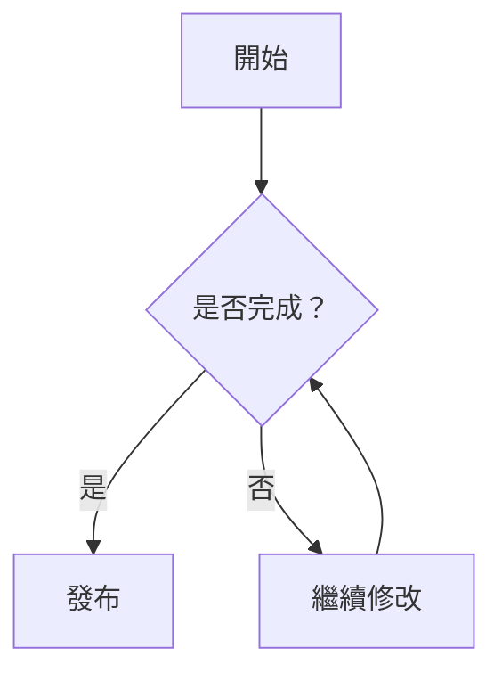

# Fuwari 寫作與維護手冊

本手冊記錄目前網站實際支援的文章格式、Markdown 擴充功能、文章頁自動行為與維護命令。修改功能後，應同步更新本文件，避免操作方式與程式行為脫節。

## 1. 快速開始

### 環境需求

- Node.js 20 或以上版本
- pnpm 10

安裝依賴並啟動開發伺服器：

```powershell
pnpm install
pnpm dev
```

本地網站預設位址：

```text
http://127.0.0.1:4321/
```

### 文章目錄

文章放在 `src/content/posts/`。建議每篇文章使用獨立目錄，正文固定命名為 `index.md`：

```text
src/content/posts/my-post/
├── index.md
├── cover.jpg
└── screenshot.png
```

這種結構便於管理文章專屬圖片，也符合 PGP 建置簽章腳本掃描 `**/index.md` 的方式。

## 2. 文章 Frontmatter

每篇文章必須以 YAML frontmatter 開頭：

```yaml
---
title: 文章標題
published: 2026-04-18
updated: 2026-04-20
description: 簡短摘要
image: ./cover.jpg
tags:
  - 旅行
category: 旅行
draft: false
lang: ""
---
```

### 欄位說明

| 欄位 | 必填 | 用途 |
| --- | --- | --- |
| `title` | 是 | 文章標題，也會供自動提交腳本產生提交訊息。 |
| `published` | 是 | 發布日期，使用 `YYYY-MM-DD`。 |
| `updated` | 否 | 文章內容最後更新日期。沒有更新時可省略。 |
| `description` | 否 | 文章摘要、SEO 描述及自動提交訊息內容。 |
| `image` | 否 | 封面圖片，可使用網路網址、公開路徑或相對路徑。 |
| `tags` | 否 | 標籤清單，用於彙整與篩選。 |
| `category` | 否 | 文章分類。 |
| `draft` | 否 | `true` 為草稿，預設為 `false`。 |
| `lang` | 否 | 文章語言與全站語言不同時才填寫。 |

注意事項：

- 空字串必須寫成 `description: ""`，不能只寫 `description:`，否則 YAML 會解析為 `null`，導致內容模型檢查失敗。
- `prevTitle`、`prevSlug`、`nextTitle`、`nextSlug` 是內部欄位，不要手動填寫。
- 本地開發環境會顯示草稿；正式建置會排除 `draft: true` 的文章。
- 相對圖片路徑以目前 Markdown 檔案所在目錄為基準，例如 `image: ./cover.jpg`。

## 3. Markdown 擴充語法

### 3.1 隱藏文字

使用雙豎線建立防劇透遮罩，滑鼠停留後顯示內容：

```markdown
這是一般文字，||這是隱藏內容||。
```

需要在隱藏內容中使用 Markdown 時，可使用文字指令：

```markdown
這段內容 :spoiler[預設隱藏 **並支援粗體**]。
```

### 3.2 提示框

支援 `tip`、`note`、`important`、`warning`、`caution`：

````markdown
:::tip
這是一則技巧提示。
:::

:::warning[自訂標題]
這是一則警告。
:::
````

也支援 GitHub 風格語法：

```markdown
> [!NOTE]
> 這是一則普通提示。
```

### 3.3 URL 預覽卡片

```markdown
::url{href="https://example.com"}
```

URL 卡片會動態取得網站圖示、標題與描述。外部服務不可用時，卡片可能無法載入完整資訊。

### 3.4 GitHub 倉庫卡片

```markdown
::github{repo="saicaca/fuwari"}
```

`repo` 必須使用 `owner/repo` 格式。卡片會透過 GitHub API 顯示倉庫資訊。

### 3.5 KaTeX 數學公式

行內公式：

```markdown
質能等價公式為 $E = mc^2$。
```

區塊公式：

```markdown
$$
x = \frac{-b \pm \sqrt{b^2 - 4ac}}{2a}
$$
```

### 3.6 Expressive Code

指定檔名：

````markdown
```javascript title="app.js"
console.log("Hello Fuwari!");
```
````

標示行號及增刪內容：

````markdown
```python {1,3-5} ins={2} del={6}
# 第 1、3、4、5 行會醒目顯示
# 第 2 行會顯示新增效果
# 中間內容
# 中間內容
# 中間內容
# 第 6 行會顯示刪除效果
```
````

常用參數：

| 參數 | 用途 |
| --- | --- |
| `title="app.js"` | 顯示檔名或標題。 |
| `{1,3-5}` | 醒目顯示指定行。 |
| `ins={2}` | 標示新增行。 |
| `del={6}` | 標示刪除行。 |
| `collapse={2-8}` | 預設折疊指定範圍。 |
| `frame="none"` | 隱藏程式碼框架。 |
| `wrap=false` | 停用自動換行。 |
| `showLineNumbers` | 顯示行號。 |
| `startLineNumber=5` | 指定起始行號。 |

### 3.7 Mermaid 圖表

````markdown

```mermaid
flowchart TD
  A[開始] --> B{是否完成？}
  B -- 是 --> C[發布]
  B -- 否 --> D[繼續修改]
  D --> B
```
````

可用於流程圖、時序圖、狀態圖與架構圖。

### 3.8 腳註

```markdown
這裡有一個腳註引用[^1]。

[^1]: 腳註內容寫在這裡。
```

腳註定義不會留在 Markdown 原位置。渲染器會把所有腳註集中到文章尾部，並自動產生 `Footnotes` 區塊。

不要在腳註定義前另外加入只有標題、沒有一般內容的 `## 參考資料`，否則頁面會同時出現空的「參考資料」與自動腳註區。若需要自訂「參考資料」標題，請改用普通編號清單，不要使用 `[^1]` 腳註語法。

### 3.9 表格

```markdown
| 尺寸 | 材質 | 顏色 |
| --- | --- | --- |
| 9 | leather | brown |
```

### 3.10 影片嵌入

可以直接使用影片平台提供的 `<iframe>`：

```html
<iframe
  width="100%"
  height="468"
  src="https://www.youtube.com/embed/VIDEO_ID"
  title="YouTube video player"
  frameborder="0"
  allowfullscreen>
</iframe>
```

- `width` 建議使用 `100%`，避免在行動裝置上溢出。
- 不要把 `<iframe>` 放進 Markdown 程式碼區塊，否則只會顯示原始碼。
- 僅嵌入可信任來源的內容。

### 3.11 外部連結

一般 Markdown 連結不需要額外處理：

```markdown
[OpenAI](https://openai.com)
[站內文章](/posts/example/)
```

外部 HTTP／HTTPS 連結會自動加入：

```html
target="_blank"
rel="noopener noreferrer"
```

站內相對連結、錨點、`mailto:` 與 `tel:` 不會被視為外部連結。

## 4. 文章頁自動功能

### 4.1 摘要、字數與閱讀時間

- 文章摘要優先使用 frontmatter 的 `description`。
- Markdown 處理流程會計算字數、閱讀時間與自動摘要。
- 字數與閱讀時間會顯示在文章頁。

### 4.2 發布與更新日期

- 顯示用的最後更新時間優先採用最新一筆有效 Git 歷史記錄。
- 找不到 Git 歷史時，才使用 frontmatter 的 `updated`。
- 文章時效判斷使用 frontmatter 的 `published` 與 `updated`，不會因一般 Git 提交而重設。

### 4.3 修訂歷史

文章頁會對目前文章檔案執行等同於以下命令的查詢：

```powershell
git log --follow -- <article-file>
```

每筆記錄會顯示提交時間、類型、短雜湊與提交訊息。提交訊息同時決定歷史分類：

| 類型 | 推薦提交格式 | 舊格式相容性 |
| --- | --- | --- |
| Feature | `feat: add article feature` | 無。 |
| Fix | `fix: correct outdated link` | `Fix ...`。 |
| Content | `content: update article` | `post:`、`posts:`、`article:`、`update:`，以及以 `Add`、`Remove`、`Refine`、`Clarify`、`Expand`、`Polish`、`Refresh`、`Update`、`Publish` 開頭的訊息。 |
| Note | 其他未識別但仍有意義的提交 | 其他一般提交訊息。 |

下列維護型提交不會顯示，也不計入文章更新次數：

```text
chore:
style:
ci:
build:
test:
lint
format
```

文章內容修改應優先使用 `content:`；修正錯誤資料、錯字或失效連結可使用 `fix:`。提交訊息必須使用英文。

### 4.4 文章時效與活動標籤

- 發布 14 天內的文章會顯示 `NEW`。
- frontmatter 的 `updated` 與發布日期不同，且更新不超過 30 天時，會顯示 `UPDATED`。
- 文章時效提示會依最後內容日期標示輕度過期、建議複核或嚴重過時。

### 4.5 文章底部功能

- `licenseConfig.enable` 啟用時顯示授權資訊。
- `gitHubEditConfig.enable` 啟用時顯示 GitHub 編輯入口。
- 留言設定完整時顯示 Giscus 留言區。
- RSS、Sitemap 與 robots 由對應的 Astro 路由及整合自動產生。

### 4.6 PGP 狀態

建置期 PGP 簽章腳本仍然保留，但文章頁的簽名驗證查詢、資料傳遞及側邊欄驗證卡片目前已暫時停用。

## 5. 寫作與維護腳本

### 5.1 建立文章

```powershell
pnpm new-post -- my-post/index.md
```

腳本會：

- 在 `src/content/posts/` 下建立檔案。
- 自動補上 `.md` 副檔名。
- 支援多層目錄。
- 拒絕覆寫已存在的檔案。
- 產生基本 frontmatter。
- 初始 `title` 會直接使用命令中的檔名參數；建立後應改成正常顯示的文章標題。

### 5.2 修正相鄰圖片排版

只檢查、不寫入：

```powershell
pnpm fix-images
```

實際修正：

```powershell
pnpm fix-images -- --write
```

腳本會在連續 Markdown 圖片或單行 HTML `` 之間加入空行，並跳過程式碼區塊。

### 5.3 自動提交文章

```powershell
pnpm post-commit
```

腳本會：

1. 找出 `src/content/posts/` 下所有已變更的 `.md` 與 `.mdx`。
2. 跳過刪除項目，並支援重新命名後的路徑。
3. 讀取 `title` 與 `description`。
4. 每篇文章分別暫存及提交。
5. 全部完成後直接執行 `git push`。

提交格式：

```text
content: publish "Title": description
content: update "Title": description
```

重要限制：

- 此命令會真實提交並推送，沒有 dry-run。
- 缺少 `title` 的文章會被跳過。
- 腳本只提交文章檔案，不處理圖片、程式碼、設定或 `.obsidian` 內容。
- 工作區同時包含其他變更時，應先檢查 `git status` 並拆分提交。

## 6. 開發、檢查與建置

### 常用命令

| 命令 | 用途 |
| --- | --- |
| `pnpm dev` | 啟動 Astro 開發伺服器。 |
| `pnpm start` | 與 `pnpm dev` 相同。 |
| `pnpm check` | 執行 Astro 診斷。 |
| `pnpm type-check` | 執行 TypeScript 類型檢查。 |
| `pnpm format` | 使用 Biome 格式化 `src/`。 |
| `pnpm lint` | 使用 Biome 檢查並自動修正 `src/`。 |
| `pnpm build` | 建立正式網站、簽章與搜尋索引。 |
| `pnpm preview` | 預覽 `dist/` 正式建置結果。 |

### 正式建置流程

`pnpm build` 依序執行：

```text
astro build
node scripts/sign-pgp-posts.js
pagefind --site dist
```

- Astro 輸出至 `dist/`。
- PGP 腳本為正式文章產生 detached signature。
- Pagefind 建立全文搜尋索引。
- 開發環境沒有完整 Pagefind 索引，搜尋元件會顯示開發提示。

## 7. 環境變數

環境變數範例位於 `.env.example`。實際密鑰只應放在未追蹤的 `.env` 或部署平台密鑰設定中。

### Umami

```env
PUBLIC_UMAMI_SRC=
PUBLIC_UMAMI_WEBSITE_ID=
PUBLIC_UMAMI_SHARE_URL=
```

- `PUBLIC_UMAMI_SRC` 與 `PUBLIC_UMAMI_WEBSITE_ID` 同時存在時才啟用分析。
- `PUBLIC_UMAMI_SHARE_URL` 用於統計分享頁連結。

### PGP 建置簽章

```env
PUBLIC_PGP_SIGNER=
PUBLIC_PGP_FINGERPRINT=
PGP_SIGNING_ENABLED=false
PGP_REQUIRE_SIGNATURES=false
PGP_PRIVATE_KEY_BASE64=
PGP_PRIVATE_KEY_PASSPHRASE=
```

- `PGP_SIGNING_ENABLED=true` 才會啟用文章簽章。
- `PGP_REQUIRE_SIGNATURES=true` 時，缺少必要密鑰會使建置失敗。
- `PGP_PRIVATE_KEY_BASE64` 用於保存 Base64 編碼的 armored 私鑰。
- 腳本也支援 `PGP_PRIVATE_KEY`，但部署環境建議使用 Base64，避免多行文字問題。
- 簽章輸出至 `dist/pgp/posts/<slug>.md.asc`，公鑰輸出至 `dist/pgp/gakiyukr.asc`。

### 其他

```env
GEMINI_API_KEY=
```

目前網站程式沒有直接使用 `GEMINI_API_KEY`。

## 8. 建議工作流程

### 只修改文章

1. 執行 `pnpm dev` 預覽文章。
2. 檢查 frontmatter、圖片、腳註與行動版排版。
3. 必要時執行 `pnpm fix-images -- --write`。
4. 執行 `pnpm check`。
5. 使用 `content:` 或 `fix:` 撰寫英文簽名提交；也可在確認工作區乾淨後使用 `pnpm post-commit`。

### 同時修改文章與程式碼

1. 先執行 `git status` 與 `git diff` 確認範圍。
2. 將文章、程式碼及本機設定拆成不同提交。
3. 每次只暫存明確屬於該提交的檔案。
4. 執行 `pnpm check`；正式發布前再執行 `pnpm build`。
5. 依倉庫規範建立英文簽名提交，再透過設定的代理推送。
